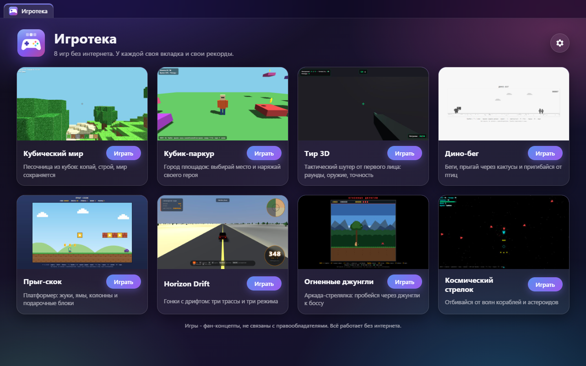
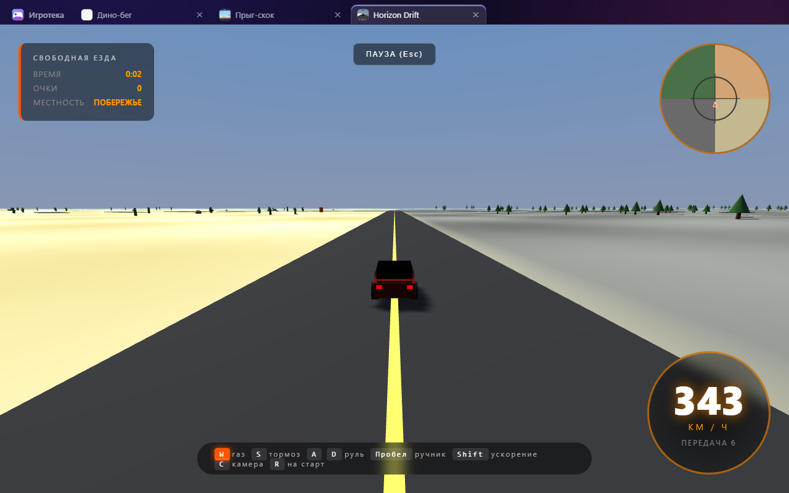
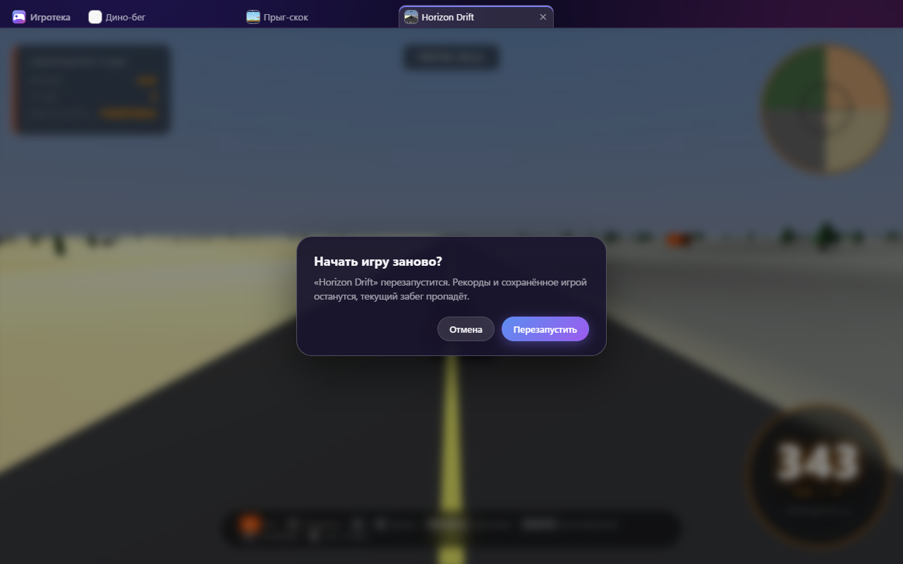
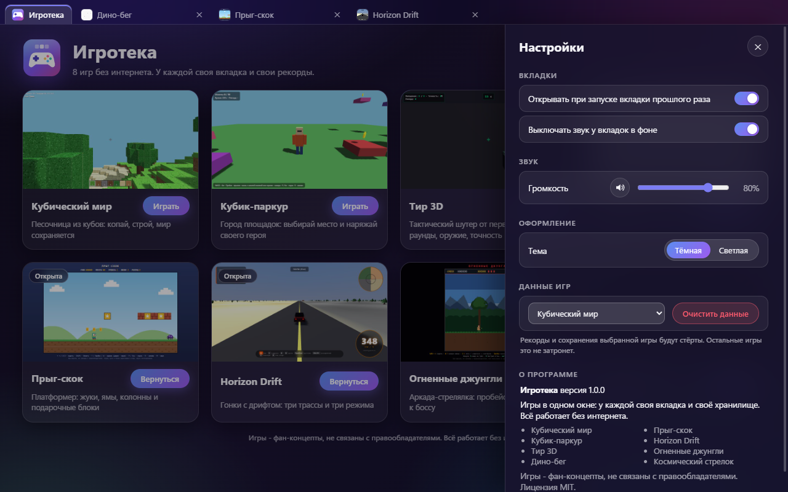
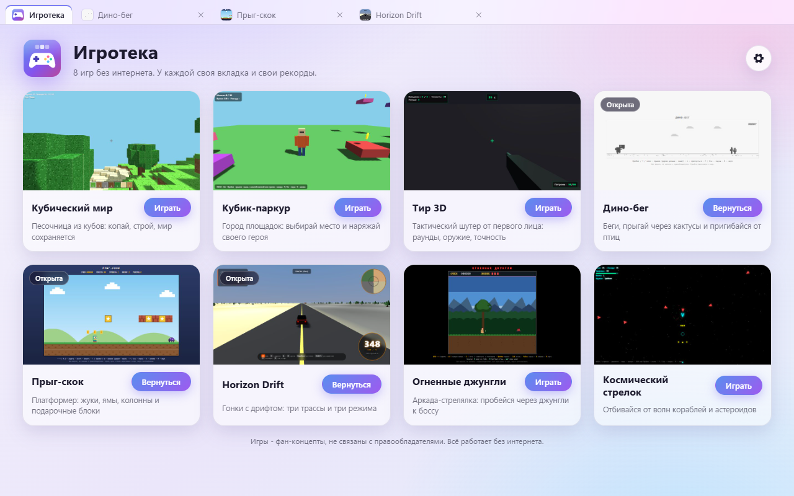
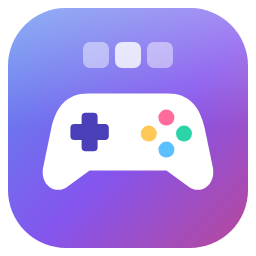

# MixOfProject

**English** · [Русский](README.ru.md)

A collection of small projects that have been fixed up, plus **Igroteka** («Игротека»,
"game library"), a desktop app that runs eight of the games from this collection in
tabs of one window.

- `web/` - 25 standalone HTML pages: games, tools and desktop-shell demos. Each opens
  with a double click on `index.html` and works offline.
- `py/` - 6 Python programs (PySide6).
- `app/` - Igroteka, the Electron desktop app.

The interface of all projects is in Russian.



## Igroteka

Eight games in one window: Cube World, Cube Parkour, 3D Shooting Range, Dino Run,
Hop-Skip (a platformer), Horizon Drift, Fire Jungle and Space Shooter. All games are fan
concepts and are not affiliated with any rights holders.



- **Tabs.** Every game opens in its own tab. Clicking the card of a game that is already
  open switches to its tab. Close a tab with its cross or the middle mouse button.
- **Separate storage per game.** One game cannot see the records and saves of another,
  and everything survives a restart. The data of a single game can be cleared in the
  settings without touching the others.
- **Background tabs are paused and silent.** A hidden game pauses, gets no animation
  frames and is muted. Checked on all eight games.
- **No network.** Game pages cannot reach the internet or read files outside their own
  folder. An external link opens in the system browser, and only after you confirm.
- **The window remembers** its size, position and maximised state, and which tabs were
  open. Reopening tabs on start can be turned off in the settings.
- App-wide volume and mute, dark and light themes.

| Keys | Action |
|---|---|
| Ctrl+T | home screen |
| Ctrl+W | close the tab |
| Ctrl+Tab / Ctrl+Shift+Tab | next / previous tab |
| Ctrl+1 … Ctrl+9 | tab by number (Ctrl+9 is the last one) |
| F11 | game full screen without the tab bar; Esc or F11 to go back |
| F5, Ctrl+R, Ctrl+F5 | restart the game (asks first); also via the tab's right-click menu |

The keys also work with the Russian keyboard layout. Cube World keeps F1, F2, F3 and F5 for
itself (F5 switches the camera there), so in it restart with Ctrl+R, Ctrl+F5 or the tab
menu. The keys a game keeps are listed in `app/games.js` (the `keys` field).

| Question over a game | Settings | Light theme |
|---|---|---|
|  |  |  |

The app icon is drawn by code: `app/assets/logo.svg`; `npm run icon` renders it into
`app/assets/icon.ico` (16-256 px, with a simplified drawing for 16-32 px) and `icon.png`.



### Run, build, test

Requires Node.js 22 or newer.

```
npm install
npm start                 # run the app
npm run dist              # build the installer and the portable exe into dist/
```

The Windows x64 build gives `dist/Igroteka-1.0.0-Setup.exe` (NSIS, per-user, no admin
rights, Russian) and `dist/Igroteka-1.0.0-Portable.exe`, 98 MB each. Only `app/` and the
eight game folders go into the build.

```
npm test                  # web/ pages in Chromium (284 checks)
npm run test:unit         # laws of the app modules and the icon (35)
npm run test:app          # the real app through Playwright (60, windows off-screen)
pip install -r requirements-py.txt
python -m pytest tests/py # py/ programs (183)
```

Helpers: `npm run thumbs` re-renders the card pictures, `npm run screenshots` takes the
pictures for this file, `npm run probe:background` shows what each game does in a
background tab.

### Renaming the app

The name lives in one place: `productName` in `package.json`. Both the app (window
title, home screen, About) and the builder (shortcuts, installer) read it. Game data does
not depend on the name and lives in `%APPDATA%\MixOfProject-Games`, so records survive a
rename. The build file names are set in Latin letters in `build.nsis.artifactName` and
`build.portable.artifactName` and can be changed separately if needed.

## Pages in `web/`

Every page is checked by a common law: it opens without errors and without network. Most
pages also have their own laws in `tests/web/<name>.spec.js`. Detailed reviews (what was
wrong and what was fixed, in Russian) are in [docs/audit/games.md](docs/audit/games.md)
and [docs/audit/apps.md](docs/audit/apps.md). Scores are after the fixes.

**Games** (scores: fun / polish / originality)

| Folder | What it is | Own laws | Score |
|---|---|---|---|
| `tetris` | Blocks: falling pieces by the classic rules, with hold and T-spins | 12 | 9 / 9 / 4 |
| `sudoku` | Sudoku with a solver, hints, pause and records per level | 11 | 8 / 9 / 5 |
| `horizon_drift_offline` | Horizon Drift: 3D drift racing, three tracks and three modes | 9 | 8 / 7 / 7 |
| `space_shooter` | Space Shooter: waves of enemies and asteroids, power-ups, record | 12 | 8 / 7 / 5 |
| `mario` | Hop-Skip: a two-level platformer with its own hero | 13 | 7 / 8 / 5 |
| `jungle-strike` | Fire Jungle: a run-and-gun arcade with a boss | 11 | 7 / 7 / 6 |
| `minecraft_clone_3d_1` | Cube World: a voxel sandbox, builds are saved | 11 | 7 / 7 / 6 |
| `dino` | Dino Run: jump over cacti and duck under birds | 11 | 6 / 8 / 3 |
| `fps_1` | 3D Shooting Range: timed target shooting | 10 | 6 / 7 / 4 |
| `roblox-mini` | Cube Parkour: collect coins on platforms against the clock | 10 | 5 / 7 / 4 |
| `volshebnyy-sad` | Magic Garden: a toy for small children, flowers and butterflies | 9 | 4 / 8 / 7 |

**Tools** (score 1-10: usefulness, reliability, completeness)

| Folder | What it is | Own laws | Score |
|---|---|---|---|
| `python_ide` | Offline Python 3.13: editor, Stop, `input()`, files | 11 | 8 |
| `calculator` | Calculator with exact decimal arithmetic and operator precedence | 40 | 8 |
| `player` | Player for your own files, remembers them after a restart | 12 | 8 |
| `english-abbreviations` | Dictionary of English abbreviations with smart search | 22 | 8 |
| `token-calc` | Token count and price estimate for a Claude request (fan concept) | 14 | 7 |
| `telegram` | Chat demo: two tabs chat live (fan concept) | 14 | 7 |
| `yandex-music` | Music service with a made-up catalogue and synthesised sound (fan concept) | 14 | 7 |
| `browser_1` | Mini browser with built-in pages, history and bookmarks | 13 | 6 |

**Desktop-shell demos** (no detailed review yet, only the common law)

| Folder | What it is |
|---|---|
| `win11_3` | A Windows 11 style shell |
| `windows_4` | A Windows style desktop |
| `macos-tahoe` | A macOS style desktop |
| `ios26` | An iOS style phone |
| `oneui7` | A One UI style phone |
| `explorer_1` | A file explorer |

## Programs in `py/`

All use PySide6 with one dark theme. Tests run without a screen
(`QT_QPA_PLATFORM=offscreen`). Review: [docs/audit/py.md](docs/audit/py.md).

| File | What it is | Tests | Score |
|---|---|---|---|
| `paint.py` | Image editor: undo, opacity, flood fill, filters | 42 | 8 |
| `compiler.py` | Mini compiler of a small language to Python with clear errors | 63 | 8 |
| `telegram_clone.py` | Chat that keeps its history, with search | 15 | 7 |
| `explorer.py` | File explorer that deletes only to the Recycle Bin and only after asking | 20 | 7 |
| `os_sim.py` | "Python95": a desktop whose windows run the programs above | 21 | 7 |
| `browser.py` | QtWebEngine browser with its own start page | 22 | 6 |

## Third-party libraries

They sit next to the pages unchanged, each with its licence text.

| Library | Where | Licence |
|---|---|---|
| three.js r149 | `web/{fps_1,horizon_drift_offline,minecraft_clone_3d_1,roblox-mini}/vendor/` | MIT |
| CodeMirror 5.65.21 | `web/python_ide/vendor/codemirror/` | MIT |
| Pyodide 0.29.5 (Python 3.13.2) | `web/python_ide/vendor/pyodide/` | MPL-2.0; Python standard library: PSF |
| pdf.js 3.11.174 | `web/token-calc/vendor/pdfjs/` | Apache-2.0 |
| mammoth 1.6.0 | `web/token-calc/vendor/mammoth/` | BSD-2-Clause |

The app is built with Electron (MIT) and electron-builder (MIT); tests use Playwright
(Apache-2.0).

## Licence

MIT, see [LICENSE](LICENSE). All games and programs are fan concepts. Names of other
products in the descriptions are only for comparison; the project is not affiliated with
the rights holders.
